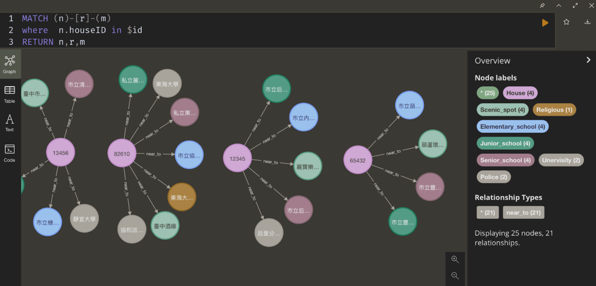

# Better Than A House Buying Experience Is To Explore Your Surroundings

# **Project Overview**

Transparency of the real estate market is crucial for a stable economy, and it is not an exception for Taiwan. The government rolled out a policy where all the real estate transaction information will all be disclosed and even be traced back to the past two million and thirty thousand real estate transaction information. We were asked to utilize some of this information as well as two types of databases to build a system that allows users to query for the past transactions. What makes our system stand out is that it emphasizes on the process of exploring the surrounding of each house property such that the searching can be even more customized. Below we will be breaking down the system into two parts: (1) the website layout and (2) the backend support for illustration.

# **Project Flowchart**

# **Data Collections and Database Constructions**

The goal of this project was to show the historical transactions not only based on the attributes associated to the house units themself but also consider some common nearby facilities that are also crucial to people’s overall satisfaction when considering buying houses. We extracted a dozen of different files that document the locations of these places and activities from [TGOS](https://www.tgos.tw/TGOS/Web/Service/Apply/TGOS_Apply_Service.aspx) (地理資訊圖資雲服務平台) apart from the essential transaction records that [Dept of Land Administration M. O. I.](https://plvr.land.moi.gov.tw/DownloadOpenData) put out. However, the tansections table does not come with location but only the address. This way we would have to utilize fuzzy matching to align with another dataset of the actual geographical locations (Figure 1).

The reason why we targeted Taichung specifically is because of the fact that they are more open in terms of the releasing of their data as compared to other major cities in Taiwan. (Table 1) shows the types of public places/activities the website interacts with in our project.

- **PostgreSQL**

Loading all these files into the database does take time and effort considering how inconsistent they are when it comes to the formats these tables utilize. For instance, each of them tends to have a different coordinate system. Luckily, we were able to sort it out at the end and properly stored the tables into PostgreSQL for the later usages. Regarding the schema we used for the database, please kindly refer to the Appendix section.

- **Neo4j**

To build the graph dataset, first we need to build each kind of node with its corresponding dataset. Either the houses or the public facilities are the nodes. For example, we convert the university dataset to the university nodes, and convert the houses from the actual price registration in Taichung to house nodes. Then, we use distance relation to build the edges of the graph. All the edges connect one house node and one public facility node. If an edge exists, it means the public facility is nearby the house. In practice, we regard the value of proximity according to different targets. Therefore, each kind of public facility deserves a different definition of proximity. We use the Postgis function , *DWithin(geom_1, geom_2, distance)*
, to calculate the proximity, and the criterias are listed in Table 2. The construction process is time consuming because we have over a hundred thousand nodes and about five hundred thousand relations in our graph database.

# **Website Layout**

We decided to use Bootstrap as part of the front-end framework, which is open-sourced and free to be utilized. Bootstrap not only features numerous HTML and CSS templates for UI interface elements, including forms, buttons (which are important for this project) or typography, tables, navigation, modals, image carousels, etc., but also supports JavaScript extensions. Therefore, it is both manageable and flexible in terms of setting up the environment and mastering it with a lot of components. For instance, a good grid system, and styling for HTML elements. Besides, the responsive CSS is designed to conform to different devices which website developers should think of when starting a long-term project with many milestones of responsive web designs we need to achieve.

In our task, the data consists of different types of objects and multiple relative attributes. To elaborate on the data as well as to bring a clearer idea to the users, we add more interactivity to the website by adopting D3.js. D3.js is a JavaScript library for manipulating documents based on data, equipped with powerful visualization components and a data-driven approach to DOM (Document Object Model) manipulation. By modeling the query result and using proper visualization methods, we are able to enlighten the users with constructive information. The details of each section in the website layout is described as follows.

- **Search Block**

The search block of the website is for users to select the houses they are looking for, by manipulating some conditions, such as price, age of house, the floor number they prefer to stay or the number of floors inside the house. Then the condition information will be sent to the server. Bootstrap also provides form layouts which we can customize form elements and inputs. Next, we did try others much more complex, such as an interface allowing users to move a slider which typically uses JavaScript and CSS as well as HTML form element to achieve the effect. However, this form design requires the URL to which the data corresponding to the user’s input should be returned and the HTTP method the data should be returned by, which we planned to leverage AJAX and PHP to handle.

Because of the limitation of capacity and time, we finally changed to Django’s form functionality, which simplifies and automates the whole process of handling the search-block form, including preparing and restructuring data to make it ready for rendering, creating HTML forms for the data, receiving and processing submitted forms and data from users. (Figure 5)

- **Filter of Public Area**

With the main concept of our project, we further add a filter to let users select which public facilities they would like to have nearby. With this filter, users could choose the environment they want to live in, considering more about their life quality, children’s education, and so on. Separated from the previous search block, the filter block will further pick the data that contains the selected public area from the searching result and show the more detailed data for users. This part has another form format, it filters the data every time users click a label. As shown in Figure 6, we have 11 conditions. Every kind of “nearby” public area is defined by different distances.

- **Display the Data and Google Map Marker**

For better displaying the data, we combine the Google Map with plain data and graph visualization that will be discussed in the next part. Figure 7 is the layout of our data display. After getting the data from our back-end, we will call Google Map Api to get the Google Map data and the authorization to convert the data to markers and show them in the map. And for more details about the houses, we will show them on the right side. Moreover, according to our topic, we care about the surrounding of the houses, so we show the public area near the houses as tags to let them have a first glimpse of their surroundings. Besides the tags, we do a small trick to let users move the specific house to the center in Google Map by clicking on data.

- **Graph Visualization**

After getting the query results of the recommended houses, which are built into the form of .json, we further visualize the result by providing a D3.js graph to show the surrounding of the houses. In the graph, each node is either a house or a public facility; each edge connects a house and its nearby public facilities. As shown in Figure 8, our graph not only displays the vital function with the eight types of public facilities, but also gives a closer look at the locality of the recommended houses, for they scatter around the whole Taichung area. For example, if we focus on the universities, 5 houses are near 國立中興大學, 2 houses are near 國立台中教育大學, 3 houses are near 亞洲大學, 東海大學, and 國立勤益科技大學, respectively. It is easier for users to make decisions according to their preferences for the residential environment, instead of just the affordability and requirement for the houses.

- **Neo4j Desktop**

Neo4j, being one of the requirements of this project, had us really think about its potential in the demo and how it can better assist us to find an ideal house via graph exploration. Neo4j has a strong presentation interface named Noe4j browser, which can express the data relationship with graphs using cypher query. Graph databases store nodes and relationships instead of tables, so here we set the houses and public facilities as nodes that contain the relative information for their attributes. For people who didn’t know cypher, we set a default query which displays the selected house and its nearby public facilities. Using the Neo4j browser can make users not only see the relationship with the graph but also check the attributes of each node. For example, if we want to check the information of a school near a house, we can just click that node and we will see the information just like the school website or telephone.

# **Backend Support**

To be able to handle the interaction between the database and the website, we need to inject the data into the databases first and implement a backend that transfers the house information as well as the website itself to the browser.

- **Django Apps**

Django is a Python-based free and open-source web framework that follows the model–template–views (MTV) architectural pattern [[wiki](https://en.wikipedia.org/wiki/Django_(web_framework))].Since we are familiar with python and the Django framework is really easy to implement, we choose Django to display our work and thought. In this project, we use Django connection to connect the PostgreSQL database, it let us filter the data with some conditions and get the data to display on the view; after that, we use template and block concepts to divide our display page into different parts, so that we can edit the different parts of view together.

Moreover, for the showing page, we add the Pagination mechanism to split the data into pages, so that the layout would be more clear and simple. We also added the Form mechanism to let the view and back-end handle searching data more easily.Next, we are going to talk in more detail how we implemented the Form mechanism and combine all the things together.

First, for the Form mechanism, it is the Django built-in package, let us define our search conditions with data types just like we do in building databases. By using it, we can clearly know the data type we use to do a query in the Form file, and we can easily use the value after the Form import. Second, for the combination, we use the main concept model–template–views (MTV) in Django to create the display part, such as html files, css files and javascript files; database part likes the structures of the table in our database;  business logic part that connect the display part and database part, and doing the query and processing the data.

# **Conclusion**

After nearly two months of intensive learning for this project, we have implemented several things that associate their own unique needs. For instance, a search bar that helps the users to identify specific houses more quickly, an interactive graph section that displays the unique set of patterns by connecting various nodes and relationships and a Django backend that enables the communication between the website and the databases in a real time fashion. Overall, lots of lessons are learned via this project. Though things can definitely be arranged in a more productive way, this has already taught us things beyond simply implementing a website but more of a way how a team can work together in terms of researching and collaborating to achieve bigger goals.

# **(Appendix) Database schema**

